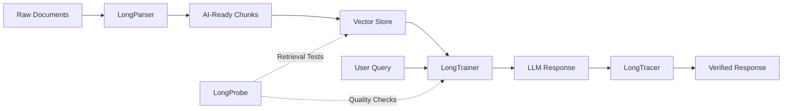

<h1 align="center">Long Suite by EnDevSols</h1>

**A modular open-source ecosystem for building production-grade Retrieval-Augmented Generation systems across document ingestion, RAG orchestration, answer verification, and retrieval testing.**

[LongParser](https://github.com/ENDEVSOLS/LongParser) ·
[LongTrainer](https://github.com/ENDEVSOLS/Long-Trainer) ·
[LongTracer](https://github.com/ENDEVSOLS/LongTracer) ·
[LongProbe](https://github.com/ENDEVSOLS/Longprobe) ·
[Discussions](https://github.com/ENDEVSOLS/Long-Suite/discussions)

---

## Overview

Long Suite is the central hub for the EnDevSols open-source RAG ecosystem.

The suite is organized around a practical production RAG lifecycle:

**Parse → Build → Verify → Test**

Each project is maintained as an independent repository. This hub exists to explain how the projects fit together, provide ecosystem-level documentation, and centralize community discussions.

---

## Projects

| Stage | Project | Role |
|:---:|:---:|:---:|
| Parse | [LongParser](https://github.com/ENDEVSOLS/LongParser) | Document parsing, extraction, and AI-ready chunk preparation |
| Build | [LongTrainer](https://github.com/ENDEVSOLS/Long-Trainer) | RAG chatbot orchestration, memory, streaming, tools, and vector search |
| Verify | [LongTracer](https://github.com/ENDEVSOLS/LongTracer) | LLM response verification and hallucination detection |
| Test | [LongProbe](https://github.com/ENDEVSOLS/Longprobe) | Retrieval regression testing and RAG quality checks |

---

## Architecture

---

## LongParser

[LongParser](https://github.com/ENDEVSOLS/LongParser) is focused on preparing documents for RAG pipelines.

It helps convert source documents into structured content that can be used for embedding, search, and downstream retrieval workflows.

Common use cases:

- Preparing documents for vector search
- Extracting structured content from files
- Creating clean chunks for RAG systems
- Improving the quality of document ingestion pipelines

Repository:  
https://github.com/ENDEVSOLS/LongParser

---

## LongTrainer

[LongTrainer](https://github.com/ENDEVSOLS/Long-Trainer) is focused on building RAG assistants and chatbot systems.

It provides the orchestration layer for document-based assistants, including retrieval, memory, streaming, tool workflows, and backend integration.

Common use cases:

- Building document-based chatbots
- Creating RAG assistants
- Managing multiple bots or knowledge bases
- Adding memory and streaming to AI applications
- Connecting retrieval workflows with application backends

Repository:  
https://github.com/ENDEVSOLS/Long-Trainer

---

## LongTracer

[LongTracer](https://github.com/ENDEVSOLS/LongTracer) is focused on verifying LLM responses against source context.

It helps identify whether generated answers are grounded in the retrieved information and whether claims are supported by the available context.

Common use cases:

- Checking if an answer is supported by retrieved sources
- Detecting unsupported or weakly supported claims
- Adding verification to RAG pipelines
- Improving trust in AI-generated responses

Repository:  
https://github.com/ENDEVSOLS/LongTracer

---

## LongProbe

[LongProbe](https://github.com/ENDEVSOLS/Longprobe) is focused on retrieval regression testing.

It helps teams detect when retrieval behavior changes after updates to chunking, embeddings, prompts, indexes, or vector store configuration.

Common use cases:

- Testing retrieval quality
- Creating golden question checks
- Detecting missing or changed retrieved chunks
- Adding RAG quality checks to development workflows
- Preventing silent retrieval regressions

Repository:  
https://github.com/ENDEVSOLS/Longprobe

---

## How the Suite Works Together

A typical Long Suite workflow looks like this:

1. Use **LongParser** to prepare documents.
2. Store the prepared chunks in a vector database.
3. Use **LongTrainer** to build a RAG assistant over the indexed knowledge base.
4. Use **LongTracer** to verify generated responses against retrieved sources.
5. Use **LongProbe** to test retrieval behavior as the system evolves.

Each tool can also be used independently.

---

## When to Use Each Project

| Requirement | Recommended Project |
|---|---|
| Prepare documents for RAG | LongParser |
| Build a document chatbot | LongTrainer |
| Add memory, streaming, tools, or retrieval orchestration | LongTrainer |
| Verify whether answers are grounded in source context | LongTracer |
| Detect hallucinated or unsupported claims | LongTracer |
| Test retrieval behavior over time | LongProbe |
| Add RAG quality checks to development workflows | LongProbe |

---

## Community

Use GitHub Discussions for ecosystem-level questions, integration help, architecture discussions, and roadmap suggestions.

Community discussions:  
https://github.com/ENDEVSOLS/Long-Suite/discussions

Use package-specific issues for bugs or implementation problems inside a specific project.

| Project | Issues |
|---|---|
| LongParser | https://github.com/ENDEVSOLS/LongParser/issues |
| LongTrainer | https://github.com/ENDEVSOLS/Long-Trainer/issues |
| LongTracer | https://github.com/ENDEVSOLS/LongTracer/issues |
| LongProbe | https://github.com/ENDEVSOLS/Longprobe/issues |

---

## Repository Scope

This repository is the central documentation and community hub for the Long Suite ecosystem.

It is used for:

- Explaining the Long Suite architecture
- Linking the individual Long Suite projects
- Sharing integration guidance
- Centralizing ecosystem-level discussions
- Coordinating cross-project direction

This repository is not a replacement for the individual project repositories. Each tool remains independently maintained and versioned.

---

## Roadmap

Roadmap discussions are handled through GitHub Discussions and project-specific issues.

Use this repository for ecosystem-level roadmap topics, such as:

- Cross-project integration
- Documentation structure
- Community support
- Architecture guidance
- Example workflows that involve more than one Long Suite project

Use the individual project repositories for package-specific feature requests, bugs, and implementation work.

Roadmap discussions:  
https://github.com/ENDEVSOLS/Long-Suite/discussions

---

## Contributing

Contributions are welcome when they improve the Long Suite ecosystem.

Good contributions for this repository include:

- Documentation improvements
- Architecture explanations
- Integration notes
- Corrections to project links or descriptions
- Examples that connect multiple Long Suite projects
- Improvements to community guidance

For changes related to a specific package, please contribute directly to the relevant repository.

| Project | Repository |
|---|---|
| LongParser | https://github.com/ENDEVSOLS/LongParser |
| LongTrainer | https://github.com/ENDEVSOLS/Long-Trainer |
| LongTracer | https://github.com/ENDEVSOLS/LongTracer |
| LongProbe | https://github.com/ENDEVSOLS/Longprobe |

---

## Maintained by EnDevSols

Long Suite is maintained by [EnDevSols](https://endevsols.com).

EnDevSols builds AI systems, automation platforms, developer tools, and production-ready software infrastructure.

---

## License

This hub repository is released under the MIT License.

Each Long Suite project may have its own license. Please check the individual project repository before using it in your application.
