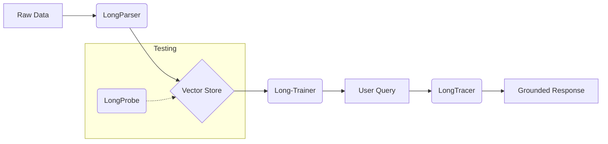

# Long Suite by EnDevSols 

### The Definitive Lifecycle for Production-Grade RAG

Most RAG applications fail in production because they lack a cohesive lifecycle. **Long-Suite** is a modular ecosystem of tools designed to handle every stage of a Retrieval-Augmented Generation pipeline—from messy data ingestion to real-time hallucination monitoring.

[Join the Community (Discussions)](https://github.com/ENDEVSOLS/Long-Suite/discussions) | [Architecture Guide](#-the-lifecycle) | [Contributing](#)

---

## 🧩 The Four Pillars

The suite is composed of four specialized, high-performance packages. They work independently but are "better together."

### 1. [LongParser](https://github.com/ENDEVSOLS/LongParser) — *The Ingestion Engine*
**Role:** Data Cleaning & Privacy.
- Scrub PII (Personally Identifiable Information) automatically.
- High-fidelity parsing of PDF, DOCX, and PPTX.
- Smart chunking optimized for semantic search.

### 2. [Long-Trainer](https://github.com/ENDEVSOLS/Long-Trainer) — *The Orchestration Core*
**Role:** The "Brain" of your Chatbot.
- Enterprise-grade bot isolation and state management.
- Native support for persistent memory (MongoDB/FAISS).
- Built for streaming and complex tool-calling workflows.

### 3. [LongProbe](https://github.com/ENDEVSOLS/LongProbe) — *The Regression Auditor*
**Role:** Quality Assurance.
- Sub-second retrieval regression testing.
- Catch lost document chunks before they hit production.
- Native LangChain partner integration.

### 4. [LongTracer](https://github.com/ENDEVSOLS/LongTracer) — *The Groundedness Guardrail*
**Role:** Real-time Monitoring.
- Detect hallucinations by verifying claims against source chunks.
- Hybrid STS + NLI scoring for extreme accuracy.
- Works as a real-time middleware for any LLM response.

---

## 🏗️ The Lifecycle

---

## 💬 Community & Support

We centralize all architectural discussions, feature requests, and Q&A in the **Long-Suite Hub**.

- **🏛️ [Architecture & Integration]**: Stuck on an implementation? Ask here.
- **🚀 [Show & Tell]**: Share your RAG pipelines.
- **💡 [Ideas & Feedback]**: For roadmap discussions.

---
*Maintained by [EnDevSols](https://endevsols.com). We build AI infrastructure that scales.*

